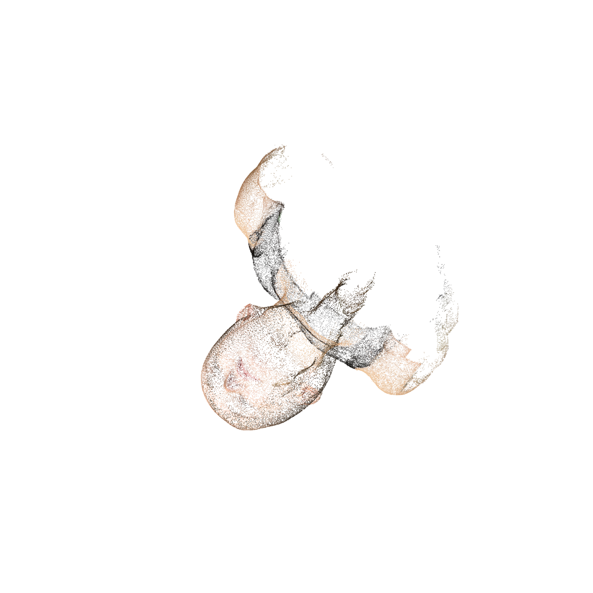

# Assignment 3 Report - Bundle Adjustment

## Overview

This assignment contains two parts:

- Task 1: implement bundle adjustment from scratch in PyTorch and reconstruct a colored 3D point cloud from 2D observations.
- Task 2: run the full COLMAP sparse and dense reconstruction pipeline on the 50 rendered images.

The final PyTorch BA point cloud is saved as `outputs/ba/reconstruction.obj`, and the final COLMAP dense point cloud is saved as `data/colmap/dense/fused.ply`.

## Environment

The reproducible conda environment is defined in `environment.yml`.

```bash
conda env create -f environment.yml
conda activate dip2026-ba
```

On the workstation used for this run:

| Component | Value |
|---|---|
| OS | Windows |
| GPU | NVIDIA GeForce RTX 3060 Laptop GPU |
| Miniconda | `C:\Users\86183\miniconda3` |
| COLMAP | `C:\Users\86183\Tools\COLMAP-4.0.4-cuda` |
| PyTorch | `2.7.1+cu118` |
| CUDA visible to PyTorch | Yes |

Git Bash is available at `C:\Program Files\Git\bin\bash.exe`. The user PATH has been updated so a newly opened terminal can find `conda`, `colmap`, and `bash`.

## Task 1: PyTorch Bundle Adjustment

### Method

The implementation in `ba_pytorch.py` estimates:

- one shared focal length `f`
- 50 camera extrinsics, parameterized by XYZ Euler angles and translations
- 20000 3D point coordinates

The projection model follows the assignment convention:

```text
[Xc, Yc, Zc] = R @ P + T
u = -f * Xc / Zc + cx
v =  f * Yc / Zc + cy
```

Only visible observations are used in the reprojection loss. The optimizer uses Adam with mini-batched visible observations, a Charbonnier reprojection loss, a small point-centering regularizer, a depth regularizer to keep points in front of the cameras under the assignment coordinate convention, and a mild focal-length prior around the initialization.

Because bundle adjustment is ambiguous up to global scale and coordinate-frame transforms, the cameras are initialized across the known frontal `+/-70` degree viewing range and translated along negative camera Z. The 3D points are initialized near the object center from the average normalized 2D observations.

### Run Command

```bash
python ba_pytorch.py --device cuda --iters 1200 --batch-size 131072 --output-dir outputs/ba
```

CPU execution is also supported:

```bash
python ba_pytorch.py --device cpu --iters 3000 --batch-size 32768 --output-dir outputs/ba_cpu
```

### Result

The CUDA run used `805089` visible 2D observations.

| Metric | Value |
|---|---:|
| Views | 50 |
| Reconstructed 3D points | 20000 |
| Optimized focal length | 882.77 px |
| Mean reprojection error | 0.724 px |
| Median reprojection error | 0.596 px |
| 90th percentile reprojection error | 1.387 px |

Loss curve:


Reconstructed colored point cloud preview:


Generated Task 1 files:

- `outputs/ba/reconstruction.obj`
- `outputs/ba/ba_parameters.npz`
- `outputs/ba/loss_curve.png`
- `outputs/ba/point_cloud_preview.png`
- `outputs/ba/summary.json`

## Task 2: COLMAP Reconstruction

### Method

The COLMAP pipeline is provided for both Windows PowerShell and Linux/Git Bash:

```powershell
.\run_colmap.ps1
```

```bash
bash run_colmap.sh
```

The scripts run:

1. SIFT feature extraction
2. Exhaustive feature matching
3. Sparse reconstruction with COLMAP mapper
4. Image undistortion
5. PatchMatch stereo
6. Stereo fusion

For a sparse-only run:

```powershell
.\run_colmap.ps1 -SparseOnly
```

or:

```bash
SPARSE_ONLY=1 bash run_colmap.sh
```

### Result

COLMAP successfully reconstructed all 50 images and produced both sparse and dense point clouds.

| Metric | Value |
|---|---:|
| Registered images | 50 / 50 |
| Sparse 3D points | 1705 |
| Sparse observations | 13630 |
| Sparse mean track length | 7.994 |
| Sparse mean reprojection error | 0.669 px |
| Fused dense points | 113432 |

Dense fused point cloud preview:



Generated Task 2 files kept in the repository:

- `data/colmap/sparse/0/`
- `data/colmap/dense/fused.ply`
- `outputs/colmap/dense_fused_preview.png`
- `outputs/colmap/colmap_summary.json`

Large reproducible COLMAP intermediates, such as `database.db`, undistorted image copies, depth maps, normal maps, and consistency graphs, are ignored by `.gitignore`.

## Validation

The following checks were run:

```bash
python -m py_compile ba_pytorch.py make_colmap_preview.py
conda run -n dip2026-ba python -c "import torch; print(torch.__version__, torch.cuda.is_available())"
colmap model_analyzer --path data/colmap/sparse/0
```

Observed validation output:

- PyTorch environment: `2.7.1+cu118`, CUDA available.
- COLMAP sparse model: 50 registered images, 1705 sparse points, 0.669 px mean reprojection error.
- COLMAP dense fusion: `113432` vertices in `data/colmap/dense/fused.ply`.
