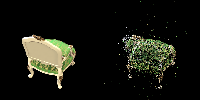
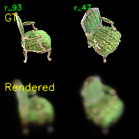
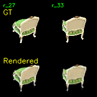

# Assignment 4 Report - Simplified 3D Gaussian Splatting

## Task 1: COLMAP Reconstruction

I used the `chair` scene and ran:

```bash
python mvs_with_colmap.py --data_dir data/chair
python debug_mvs_by_projecting_pts.py --data_dir data/chair
```

The COLMAP pipeline completed successfully and produced:

- `data/chair/database.db`
- `data/chair/sparse/0_text/cameras.txt`
- `data/chair/sparse/0_text/images.txt`
- `data/chair/sparse/0_text/points3D.txt`
- 100 projection debug images in `data/chair/projections/`

The reconstructed sparse point cloud contains 14,363 points, and all 100 input images are registered in the dataset loader.

## Task 2: Simplified 3DGS Implementation

The core TODOs were implemented in:

- `gaussian_model.py`: construct the 3D covariance matrix as `Sigma = (R S)(R S)^T`.
- `gaussian_renderer.py`: project 3D Gaussians to 2D with the perspective Jacobian.
- `gaussian_renderer.py`: evaluate normalized 2D Gaussian density values.
- `gaussian_renderer.py`: perform front-to-back alpha compositing using accumulated transmittance.

I also added small compatibility fixes:

- `mvs_with_colmap.py` now resolves `COLMAP.bat` correctly on Windows.
- `data_utils.py` and `gaussian_model.py` have lightweight fallbacks when `natsort` or `pytorch3d` are not installed.
- The final color accumulation uses `torch.einsum` instead of expanding colors to `(N, H, W, 3)`, which reduces memory usage.

I verified the implementation with:

```bash
python -m py_compile gaussian_model.py gaussian_renderer.py data_utils.py mvs_with_colmap.py train.py render_3dgs_mv.py
```

I also ran a tensor-level forward/backward smoke test and confirmed finite output and gradients.

## Training Verification

I ran a short end-to-end training pass:

```bash
python train.py --colmap_dir data/chair --checkpoint_dir data/chair/checkpoints --num_epochs 1 --debug_every 1 --debug_samples 2 --device cuda
```

Environment:

- GPU: NVIDIA GeForce RTX 3090
- Input images: 100
- Render resolution after downsampling: 100 x 100
- Sparse points: 14,363

Result:

- Final average L1 loss after epoch 0: about 0.0812
- Checkpoint: `data/chair/checkpoints/checkpoint_000000.pt`
- Debug image: `data/chair/checkpoints/debug_images/epoch_0000.png`
- Debug rendering video: `data/chair/checkpoints/debug_rendering.mp4`

This verifies that the COLMAP loader, Gaussian model, differentiable renderer, optimizer, checkpointing, and visualization path all run end to end.

## Result Visualization

COLMAP sparse point reprojection result:

<p align="center">
  
</p>

One-epoch simplified 3DGS training debug result. The top row shows ground-truth views, and the bottom row shows the corresponding rendered views after epoch 0:

<p align="center">
  
</p>

The rendered views are still blurry because this is only a one-epoch sanity-check run at 100 x 100 render resolution. The simplified implementation also keeps a fixed sparse COLMAP Gaussian set and does not use adaptive densification, pruning, or the optimized rasterization strategy from the official 3DGS implementation.

I then continued training to epoch 40 and stopped after the epoch-40 checkpoint was saved:

```bash
python train.py --colmap_dir data/chair --checkpoint_dir data/chair/final_checkpoints --num_epochs 61 --debug_every 20 --debug_samples 2 --device cuda
```

Final trained result at epoch 40:

- Final average L1 loss at epoch 40: about 0.0266
- Checkpoint: `data/chair/final_checkpoints/checkpoint_000040.pt`
- Debug image: `data/chair/final_checkpoints/debug_images/epoch_0040.png`

<p align="center">
  
</p>

Compared with the one-epoch sanity-check image, the epoch-40 rendering has sharper chair boundaries and more stable color reconstruction. It is still not as sharp as the official 3DGS result because this implementation does not densify or prune Gaussians and still renders at the downsampled 100 x 100 resolution.

The earlier one-epoch sanity-check multi-view debug rendering video is saved at:

[`data/chair/checkpoints/debug_rendering.mp4`](data/chair/checkpoints/debug_rendering.mp4)

## Task 3: Comparison With Official 3DGS

This simplified PyTorch implementation is intentionally much less optimized than the official 3DGS implementation.

Rendering quality:

- This implementation uses a sparse COLMAP initialization and optimizes fixed Gaussians without adaptive densification.
- The official implementation adds Gaussian densification, pruning, better rasterization, and more mature training heuristics, so it should produce sharper and more complete geometry after sufficient training.

Training speed:

- This implementation evaluates all Gaussians over the full image grid, which is simple and differentiable but expensive.
- The official implementation uses CUDA rasterization and tile-based splatting, so it is expected to be much faster at higher resolutions and larger point counts.

Memory usage:

- This implementation still materializes large `(N, H, W)` tensors for Gaussian values and alpha weights.
- The official implementation avoids much of this memory cost through custom rasterization kernels.

The official implementation was not run in this pass, so the report currently records a qualitative comparison rather than measured official runtime, memory, and image-quality numbers.
